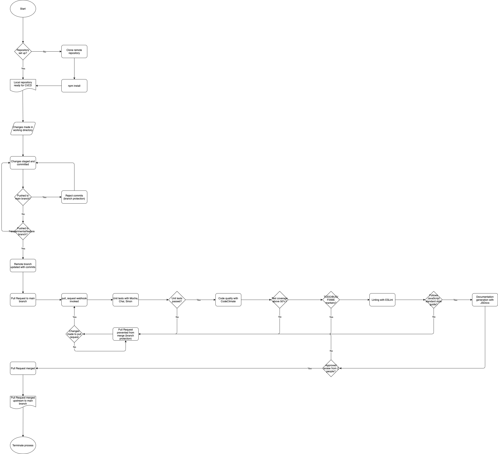

# CI Pipeline Phase One
## Introduction
This artifact is presented as an update to everyone on the status of the first iteration of our CI pipeline.
Included in this document is a flowchart describing our current CI pipeline, what is currently implemented, and
what we plan to include for the next iteration. It should be noted that the flowchart of our CI pipeline illustrates
what we envision as the final iteration.

## Diagram
Below is a flowchart illustrating our CI pipeline:

## Current CI progress
The current process is explained as follows:
1. Version control process
   - Each team member works on a local clone of the group repository. Changes should be made on their own respective branch.
   - In order to streamline what is pushed onto the main branch, we enabled branch protections in order to prevent pushing changes locally to the main branch on the remote repository. Instead, team members push their changes to a remote branch corresponding to the branch worked on locally.
   - Once changes on a feature/experimental branch are ready to be merged with the main branch, a pull request is created. This is where the required status checks (unit tests, linting, code quality review, coverage, etc.) are verified. If any status check fails, we use branch protection in order to prevent merging the pull request.
2. CI process for pull requests
   - Once a pull request is initiated, the first status check that is done is for unit testing. For unit testing in our repository, we use Mocha for the testing framework, Chai as the assertion library, and Sinon for mocks/stubs/spies to test calls to our backend. Tests are located under `./source/javascript/tests/.`. This status check passes if all unit tests in this subdirectory are successful.
   - The second status check that is done is for linting. For our project, we use ESLint with StandardJS as our chosen style guide. This status check determines whether the code written underneath `./source/javascript/tests/.` and `./source/javascript/src/.` conforms to the StandardJS styleguide. (We should note that we included additional config information for ESLint in order to alleviate some issues presented with unused, but necessary, variables for unit testing with Chai)
   - The third status check is for code quality. We decided to use CodeClimate for benchmarking code quality. For our setup, we permitted CodeClimate to make comments directly onto pull requests to provide a summary of any associated code smells, complexity, etc.
   - The fourth status check is for documentation generation. This status check verifies that we are still able to generate documentation for our project under the `./source/javascript/src/.` subdirectory to the target subdirectory `./specs/ci-cd/docs/.`. Consequently, this status check fails in the instance where source files are misplaced or if our build process with Node is outdated. In order to remove the bloat associated with commits for pull requests, it should be noted that we included `./specs/ci-cd/docs/.` in our `.gitignore` file. This documentation can still be accessed locally.

## Planned CI progress
Included below is a list of what we plan to include for the next iteration of our CI pipeline.
1. Code coverage
   - CodeClimate offers plugins in order to enforce code coverage as a status check during pull request review. Consequently, we plan to explore this option during phase two. Since we are relatively inexperienced with software engineering, the degree to which we enforce code coverage will be relaxed (~50%).
2. TODO/FIXME/misc. markers
   - Code pushed onto the main branch should exclude any markers that indicate a problem has yet to be dealt with. Traditionally, this is indicated with TODO/FIXME markers. We therefore plan to explore an additional plugin with CodeClimate to determine whether these markers are present in pull requests.

