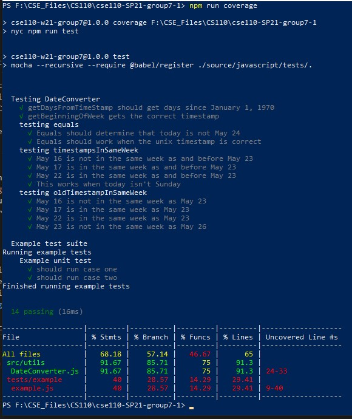

# CSE110 Group 7 - RIVER

Welcome to the CSE 110 Group 7 GitHub Repository! Our team is called RIVER, which is an acronym for Reflection, Improvement, Values, Empowerment, Refinement. Throughout spring quarter, we have created a digital Bullet Journal. 

Learn more about each of our members and our goals on the [RIVER Team Page](admin/team.md).

## Team River's Bullet Journal: 
You can access tha app [here](https://cse110-w21-group7.github.io/cse110-SP21-group7/)    
  

## Final project videos
- [final video public version](https://youtu.be/U-Qt9tbzNeA)
- [final video private version](TODO)

## CI/CD Pipeline Information and Documentation:
All of the information about the CI/CD pipleine can be found [here](https://github.com/cse110-w21-group7/cse110-SP21-group7/tree/main/admin/cipipeline). In this folder, you can see the full [writeup](admin/cipipeline/phase1.md), [video](admin/cipipeline/phase1.mp4), and accompanying flowcharts [here](admin/cipipeline/phase1.png) and [here](admin/cipipeline/phase2.png). 

## Design

We keep all of the design documentation of our RIVER Bullet Journal app inside the **/specs** folder.

- See our 15 **architecture decision records [(ADR)](https://github.com/cse110-w21-group7/cse110-SP21-group7/tree/main/specs/adr)**.

- You can find our pitch document at this [link](https://github.com/cse110-w21-group7/cse110-SP21-group7/tree/main/specs/pitch). In this file, we go over our team's Problem Statement, Problem Constraints, proposed design, early iterations of our design, rabbit holes, and No-gos.

- Our team has come up with multiple UI versions of RIVER Bullet Journal together, you can find them [here](https://github.com/cse110-w21-group7/cse110-SP21-group7/tree/main/specs/interface)!

- For our style guidlines, we used ESLint and [JSDocs](https://github.com/shri/JSDoc-Style-Guide) to ensure all contributors have the same style, and we enforce the style automatically in our CI/CD pipeline. You can automatically fix your styling by running ```npm fix``` in your console.

- To desgin this website, we created 5 [user personas](https://github.com/cse110-w21-group7/cse110-SP21-group7/tree/main/specs/users) for potential users of the RIVER journal.

## Sprints
#### Once we finished our rough design of the website, we moved on to implement our RIVER Bullet Journal. To realize our project, we had 3 sprints following the agile method with a Final Retro session in the end. We assigned tasks for each sprint every standup.

- Sprint 1
  - [Assign roles](https://github.com/cse110-w21-group7/cse110-SP21-group7/blob/main/admin/standups/standup_may6.md)
  - [Retrospective](https://github.com/cse110-w21-group7/cse110-SP21-group7/blob/brettherbst-patch-1/admin/meetings/051521-retrospective.md)
  - [Review](https://github.com/cse110-w21-group7/cse110-SP21-group7/blob/brettherbst-patch-1/admin/meetings/051521-sprint-review.md)
  
- Sprint 2
  - [Retrospective](https://github.com/cse110-w21-group7/cse110-SP21-group7/blob/brettherbst-patch-1/admin/meetings/052221-retrospective2.md)
  - [Review](https://github.com/cse110-w21-group7/cse110-SP21-group7/blob/brettherbst-patch-1/admin/meetings/052221-sprint-2-review.md)

- Sprint 3
  - [Retrospective](https://github.com/cse110-w21-group7/cse110-SP21-group7/blob/brettherbst-patch-1/admin/meetings/052921-retro3.md)
  - [Review](https://github.com/cse110-w21-group7/cse110-SP21-group7/blob/brettherbst-patch-1/admin/meetings/052921-sprint-review-3.md)
  
- Final [Retro](https://github.com/cse110-w21-group7/cse110-SP21-group7/blob/brettherbst-patch-1/admin/meetings/060621-finalRetro.md)
## Admins
- You can find our team 7 branding [here](https://github.com/cse110-w21-group7/cse110-SP21-group7/tree/brettherbst-patch-1/admin/branding).
- All of the standup records are in the [standups](https://github.com/cse110-w21-group7/cse110-SP21-group7/tree/brettherbst-patch-1/admin/standups)   folder (We had standups every Tuesday, Thursday, and Saturday).
- We keep all of our meeting notes in the [meetings](https://github.com/cse110-w21-group7/cse110-SP21-group7/tree/brettherbst-patch-1/admin/meetings) folder.
- You can also check out our status video [here](https://github.com/cse110-w21-group7/cse110-SP21-group7/tree/brettherbst-patch-1/admin/videos).

## Source
  Inside the [Source](https://github.com/cse110-w21-group7/cse110-SP21-group7/tree/brettherbst-patch-1/source) folder, you can find all the sources that we used in building this RIVER Bullet Journal web application. All files are categorized by their file types into different folders, and you can find the files you are looking for easily, for instance, [Javascript](https://github.com/cse110-w21-group7/cse110-SP21-group7/tree/brettherbst-patch-1/source/javascript), [HTML](https://github.com/cse110-w21-group7/cse110-SP21-group7/tree/brettherbst-patch-1/source/html), and [CSS](https://github.com/cse110-w21-group7/cse110-SP21-group7/tree/brettherbst-patch-1/source/css). 


## Testing
For testing our code, we use Mocha, Chai, Sinon to ensure the quality of our app. For our end to end testing, we use Pupeteer to enusre the user flow from page to page was correct for all naviagtions throughout the site. We also performed Unit Tests on our custom class [DataConverter](https://github.com/cse110-w21-group7/cse110-SP21-group7/blob/main/source/javascript/src/utils/DateConverter.js).  
- You can run a coverage test by typing in your console ```npm run coverage```  
  
- TODO test


## Contribute to this project
If you want to contribute to our RIVER Bullet Journal Project, please follow the instructions below.
1. Clone this Repository to your local machine by clicking on the green button that says "Code" on the github remote server and copy the URL of the repository. Then open your local terminal and do ``` git clone <Repo-URL>``` to clone the repository from remote to local.
2. Create a new branch on your local machine and start your work from there. You can use the ```git checkout -b <branch-name>``` command on your local terminal to create a new branch.
3. After finish working on your branch and committed locally, you can do ```git push -u origin <branch>``` to push your branch to the remote server. 
4. Make a pull request and give detailed description about the changes you make and wait for response from other group members.


## Building the APP
- For our minification step we used Gulp. Gulp helps to remove overhead (node_modules/ which we used for development, artifacts, etc.) in addition to minifying files.  
## Deploying the APP
- The RIVER bullet Journal is published through GitHub Pages, so once the changes in the pull requests are merged, the changes to the web app can be seen right away.
