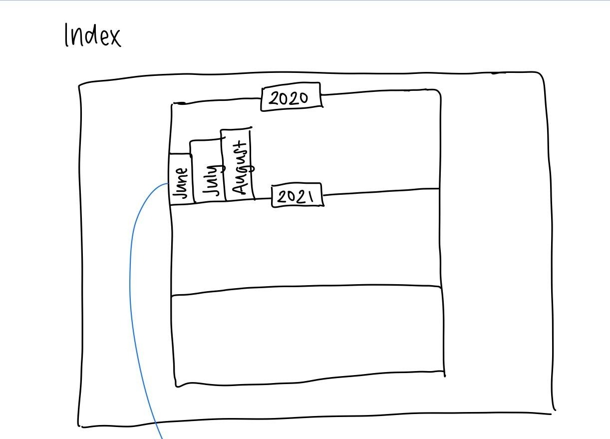
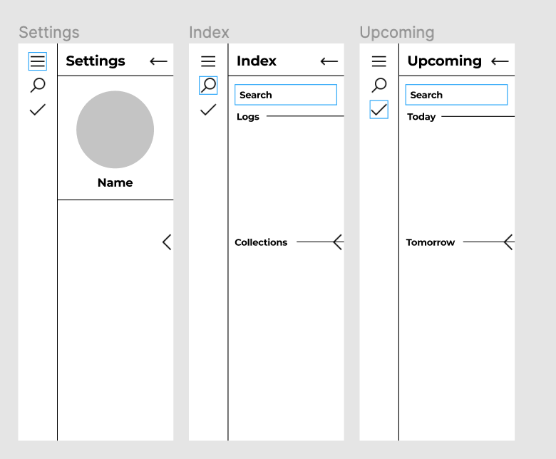

# RIVER Bullet Journal Pitch
# May 2, 2021

## Problem Statement
For individuals in their undergraduate studies/starting point of their career, formulating a weekly and daily schedule is often an ad-hoc procedure; tools that don’t directly promote organization are often used in order to accomplish this. For instance, below is an example of how my weekly schedule is managed on Apple Notes.

Notice how there is no way to distinguish between completed/uncompleted tasks, notes about each day, special occasions, etc. Furthermore, if tasks are not completed, it is cumbersome to remember what still needs to be done, in addition to how uncompleted tasks should be dealt with. Ultimately, as a student, I want an easy way to organize, manage, and reflect on my schedule, so that I can more effectively manage my time and assess what still needs to be accomplished.

## Appetite/Problem Constraints
Since this project’s timeframe is limited by the remaining time for the spring quarter, we formulated our design specification to have an expected time of completion of six weeks.
Miscellaneous obligations. We respect the assumption that everyone on our team is a full time student with other commitments. We constrain our problem based on the amount of time each member is willing to commit. Our rules.md file contains information about the amount of time everyone is willing to spend on a weekly basis.
Weekly lab work. The labs contain essential information for each component of the deliverable for this project. For instance, the final project needs a CI/CD pipeline, unit testing, etc. Since labs are released on a weekly basis, this staggers our ability to plan batch plan our project/evaluate everything up front
I.e. we have some exposure to CI/CD, but cannot make strong inferences on how much time must be committed to unit testing/QA

## Proposed Design Specification

We are proposing a web-app encapsulating the functionality of a bullet journal. Attached are low-level diagrams describing how it works:
 - Index
   - [Wireframes](/specs/interface/wireframes/index-wireframe.png)
 - Monthly/Weekly Index
   - [Wireframes](/specs/interface/wireframes/monthly-weekly-wireframe.png)
 - Collections
   - [Wireframes](/specs/interface/wireframes/Collections-wireframe.PNG)
 - Daily Log
   - [Wireframes](/specs/interface/wireframes/dailylog-wireframe.md)

## Rabbit Holes
 - Will searching from the index be addressed?
Our first iteration of fat marker sketches did not offer a practical way to search for logs or collections relative to the current date. Below is an example of the first instance of our fat marker sketch for the index. While it is possible to access logs on a monthly basis, we did not provide any additional search capabilities.

Below is the reshaped low-level design of how search will work across our bullet journal. A menu sidebar is displayed for all users, containing the following features:
Settings home - When the menu sidebar is given focus, a user’s profile and name should be displayed
Search by log/collection - When the search icon is given focus, A text field appears, containing search queries for logs and collections
Search by tasks - When the checkmark icon is given focus, a text field appears, in which users can enter queries for tasks relative to the current date

 - From the weekly index, can we edit to-do’s directly (i.e. with toggling)?
To-do’s will not support editing from the weekly index. We decided that the weekly index should solely serve the purpose of navigation and quick reference of daily logs for any given week. This decision was made in order to focus on the essential features of the weekly index, in addition to respecting the time constraints of our project.

 - For rapid logging, if a new task/note/event is improperly formatted, how will this be handled?
Daily logs aim to support a markdown-like approach for recording new tasks/notes/events. If any part of the daily log cannot be parsed properly, the user should receive a popup notification indicating which line is improperly formatted.

## No-gos
The features we decide to implement into our final project encapsulate the core functionality a bullet journal should provide. Given the appetite/time constraints of our project, we decided the following features will be discarded from our final project:
 - Subtasks/subnotes/subevents - This was mentioned briefly early in the design process. We anticipate that subtasks/subnotes/subevents have weird use cases that we are not comfortable with including, given the current constraints of our project. For instance, if a task contains sub-tasks, and a subset of these subtasks are completed, how will auto migration handle this?
 - Monthly/weekly index editing - Each component of our bullet journal should focus on one thing and do it well. With respect to the monthly/weekly index, we want to focus our efforts on making it as intuitive as possible for navigating, i.e. navigating to daily logs for different weeks, having a brief overview of the content of daily logs, etc.
	However, as a stretch goal, we will look into the following features if time permits:
 - Color highlighting for rapid logging

